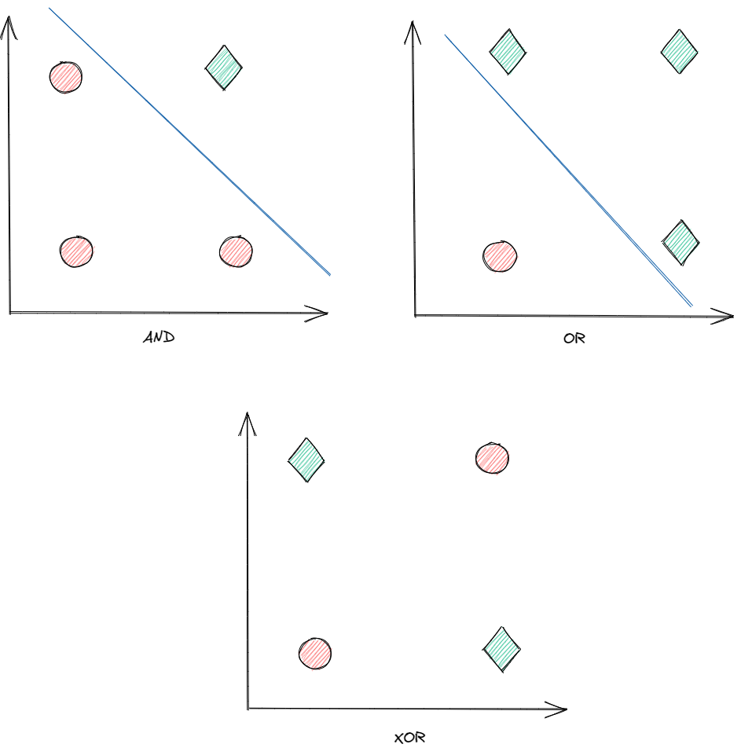
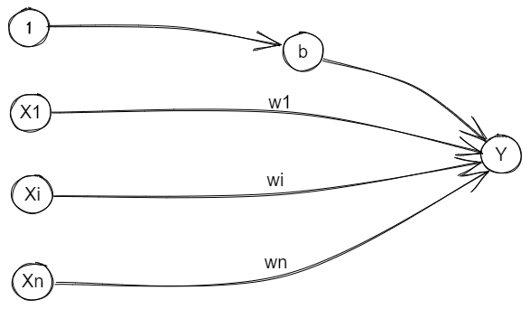

# Perceptron

Perceptron is a Hello, World! of neural networks.  A single layer Perceptron is a very simple neural network that as shown by book [Perceptron: An Introduction to Computational Geometry by Minsky and Papert](https://mitpress.mit.edu/books/perceptrons) is unable to separate nonlinear problems.  For example, Perceptron can correctly solve bitwise operations AND and OR but it is not able to solve XOR as shown on picture below.

This tutorial will show how Perceptron can learn to correctly solve for AND and OR but not XOR.

# Architecture

Simple Perceptron is made of N input nodes connected to single output node.  

The input nodes take a vector of 0s or 1s and the output node is either 0 or 1.  That is, 0 represents class 1 and 1 represents class 2.  Simply Perceptron is a binary or two-class classifier.

Notice the bias that acts as a weight on a connection from a unit whose activation is always 1.  If the bias is included the activation function looks like this:

f(net) = 1 if net >= 0 or -1 if net < 0

where

net = b + $\sum_{i=1}^{n} x_iw_i$

If bias was not used than some threshold $\theta$ would be required:

f(net) = 1 if net >= $\theta$ or -1 if net < $\theta$

where

net = $\sum_{i=1}^{n} x_iw_i$

# Algorithm

*Step 1*

- Initialize weights with random values and set bias to 1.
- Set learning rate $\alpha$ to 0 < $\alpha$ <= 1, but for simplicity it can be set to 1.

*Step 2*

- While stopping condition is false, do steps 3-7.

*Step 3*

- For each training pair $x_j$ and class label $d_j$, do steps 4-6.

*Step 4*

- Set activation of input units from feature vector $x_j$.

*Step_5*

- Compute response of output unit: $y_j$ = w $\cdot$ $x_j$

*Step 6*

- Update weights: $w_i$(new) = $w_i$(old) + $\alpha$($d_j$ - $y_j$)xi,j for 0 <= i <= n

# Training

Perceptron training is a simple process.  The goal is to adjust weights so they can correctly classify each instance in training set.  We achieve this by feeding Perceptron with training data multiple times.  Each time we present full training set we call it an *epoch*.

# Delta Rule

Perceptron uses Delta Rule for the actual learning.  This is captured by step 6 in Algorithm section above.  The expression ($d_j$ - $y_j$) checks if the classification was correct.  If it is zero then it was correct.  Otherwise, if the difference is positive or negative it gives us the direction the weight should be adjusted to.

This is derivation of the squared error for training pattern d:

E = $(d - y\_in)^2$

where y_in = $\sum_{i=1}^{n} x_iw_i$

The gradient E is the vector of the partial derivatives of E with respect to each weight.  The gradient gives direction of the increase or decrease in the error.  The error can be reduced by adjusting the weights $w_I$ in the direction of - ∂E/∂$w_I$

Since y_in = $\sum_{i=1}^{n} x_iw_i$

∂E/∂$w_I$ = - 2(d - $y_in$) ∂y_in/∂$w_I$
          = -2(d - $y_in$)$x_I$

So for the learning rate $\alpha$ the error will be reduced most quickly by adjusting weights according to the delate rule:

$\Delta$$w_I$ = $\alpha$(d - $y\_in$)$x_I$

